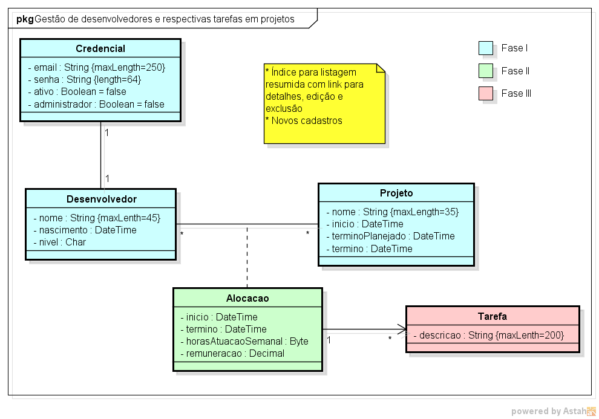

# Project-Manager
### Gerenciador de projetos com login desenvolvido na disciplina de Desenvolvimento Web utilizando PHP.

 
O projeto foi desenvolvido em etapas, implmentando as classes do diagrama a medida que o professor ensinava os relacionamentos entre beans no RedBean.
 

<figcaption align = "center"><b>Diagrama de Classes utilizado.</b></figcaption>
